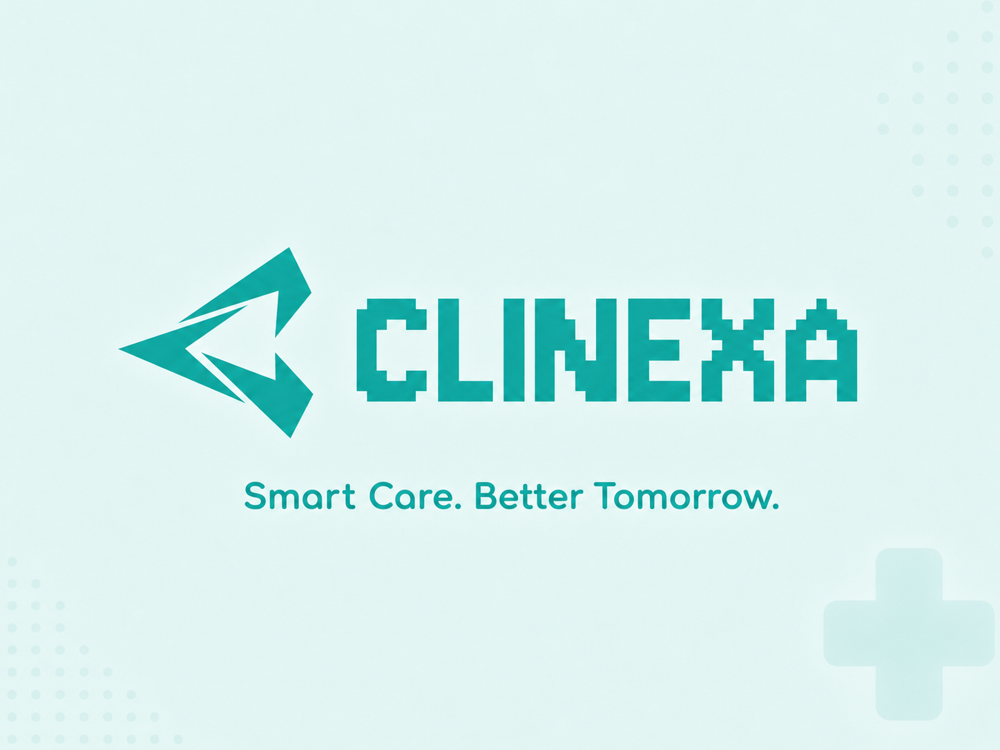
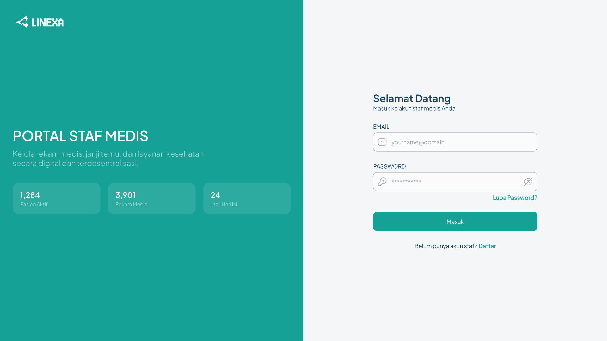
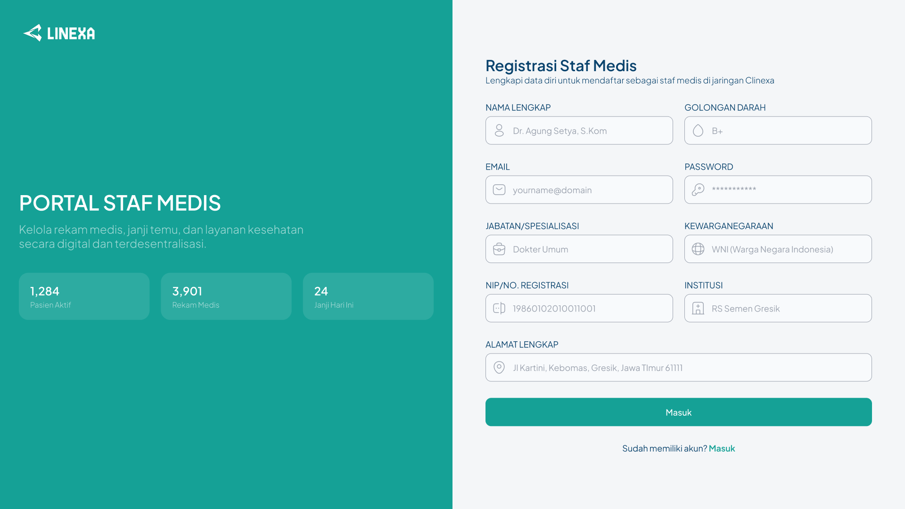
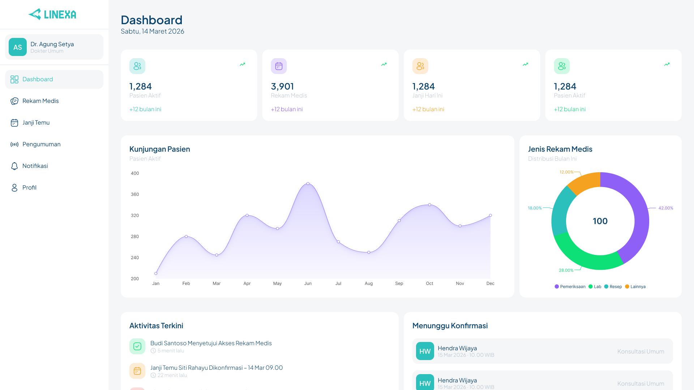

## Fitur Utama

- Portal staf medis untuk login dan registrasi.
- Dashboard dokter berisi metrik pasien, rekam medis, janji temu, aktivitas, dan konfirmasi.
- Manajemen rekam medis dengan status akses: diberikan, menunggu izin, atau ditolak.
- Manajemen janji temu pasien dengan status konfirmasi.
- Backend API untuk patient, doctor, clinic, consent, document upload, dan audit log.
- Integrasi Supabase Auth, Supabase Database, dan Supabase Storage.
- Integrasi Solana devnet untuk pencatatan on-chain.

## Smart Contract

Program Clinexa sudah dideploy ke Solana devnet.

```text
Program ID: Fc3XwtPFqwkjr4gsQ4uGbcxeyUJ6SbasRyEWLhM9wPV6
Network: Solana Devnet
```

## Tech Stack

- Frontend: React, Vite, TypeScript
- Backend: Node.js, Express, TypeScript
- Auth/Database/Storage: Supabase
- Blockchain: Solana, Anchor
- UI Icons: lucide-react

## Preview UI

### Login



### Registrasi Staf Medis



### Dashboard



### Rekam Medis


### Janji Temu


## Struktur Project

```text
.
├── backend/        # Express API, Supabase, encryption, Solana service
├── frontend/       # React + Vite staff medical portal
├── programs/       # Anchor program
├── Anchor.toml     # Anchor configuration
└── README.md
```

## Menjalankan Local

### Backend

```bash
cd backend
cp .env.example .env
npm install
npm run build
npm run dev
```

### Frontend

```bash
cd frontend
cp .env.example .env
npm install
npm run dev
```

## Environment

Backend membutuhkan:

```env
PORT=4000
SUPABASE_URL=
SUPABASE_ANON_KEY=
SUPABASE_SERVICE_ROLE_KEY=
APP_ENCRYPTION_KEY=
SOLANA_RPC_URL=https://api.devnet.solana.com
SOLANA_PROGRAM_ID=Fc3XwtPFqwkjr4gsQ4uGbcxeyUJ6SbasRyEWLhM9wPV6
SOLANA_PAYER_PRIVATE_KEY=
```

Frontend membutuhkan:

```env
VITE_API_BASE_URL=http://localhost:4000
VITE_SUPABASE_URL=
VITE_SUPABASE_ANON_KEY=
```

## Deployment Notes

Jangan commit file rahasia atau output build. File seperti `.env`, private key wallet, `target/`, `dist/`, `node_modules/`, dan `PLAN.md` sudah dimasukkan ke `.gitignore`.

Untuk production, gunakan environment variable dari platform deploy dan jangan menaruh secret langsung di repository.
